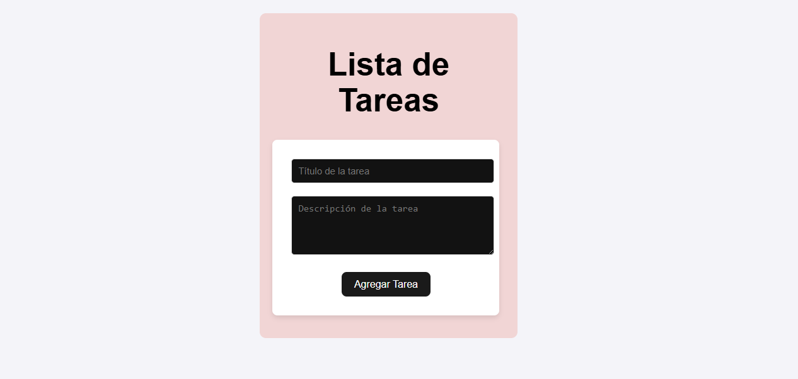
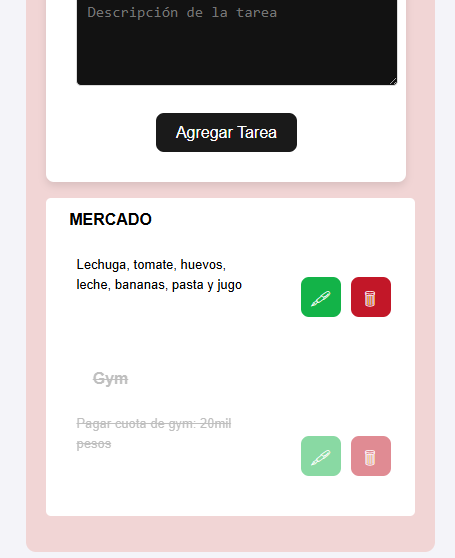
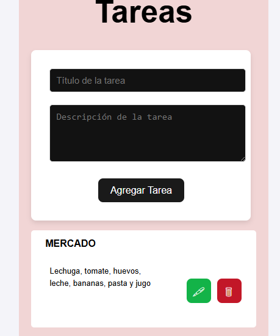
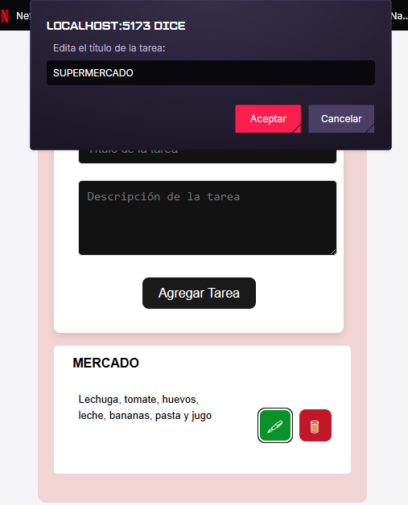
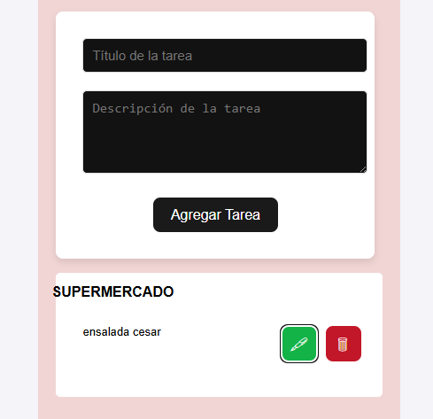
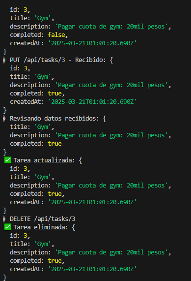

Explicación de LA "LISTA DE TAREAS":

La aplicación permite gestionar tareas de forma sencilla con las siguientes funcionalidades:
- Crear nuevas tareas.
- Editar tareas existentes.
- Eliminar tareas.
- Marcar tareas como completadas.

Para ejecutar el programa: 
- Desde la terminal se debe iniciar React + Vite con 'npm run dev'. (En el repositorio de /frontend)
- Luego, para express con 'node index.js'. (En el repositorio de /backend)
- En el terminal donde se ejecuto React, va salir ➜  Local:http://localhost:5173/ para ingresar desde el navegador 
  a la pagina web de la lista de tareas.

  

  

  

  

  

  
